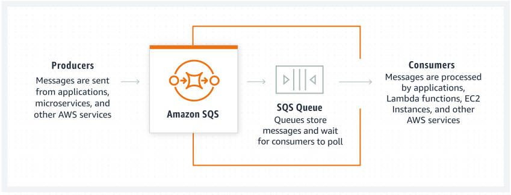

# Cloud Fundamentals: AWS Services for C# Developers

## AWS SQS

Amazon SQS provides queues for high-throughput, system-to-system messaging. You can use queues to decouple heavyweight
processes and to buffer and batch work. Amazon SQS stores messages until microservices and serverless applications
process them.

Amazon SQS allows producers to send messages to a queue. Messages are then stored in an SQS Queue. When consumers are
ready to process new messages they poll them from the queue. Applications, microservices, and multiple AWS services can
take the role of producers or consumers.
Queue types:

- Standard - support nearly unlimited transactions per second. A message is delivered at least once, but occasionally
  more that one copy of a message is delivered. Standard queues provide best-effort ordering. Occasionally, messages
  might be delivered in an order different from which they were sent.
- FIFO - support up to 3000 messages per second, each message is delivered eactly once, and message order is preserved.
  FIFO queues are designed to enhance messaging between applications when the order of operations and events is
  critical, or where duplicates can't be tolerated.

A message can have such configuration:

- Visibility timeout - sets the length of time that a message received from a queue (by one consumer) will not be
  visible to the other message consumers.
- Message retention period - the amount of time that Amazon SQS retains a message that does not get deleted.
- Delivery delay - the amount of time to delay the first delivery of each message added to the queue.
- Maximum message size - up to 256kb
- Receive message wait time - is the maximum amount of time that polling will wait for messages to become available to
  receive.

## AWS SNS (Simple Notification Service)

Amazon SNS is a highly available, durable, secure, fully managed pub/sub messaging service that enables you to decouple
microservices, distributed systems, and event-driven serverless applications. Amazon SNS provides topics for
high-throughput, push-based, many-to-many messaging.

SNS Topic types:

- FIFO
    - Strictly-preserved message ordering
    - Exactly-once message delivery
    - High throughput, up to 300 publishes/second
    - Subscription protocols: SQS
- Standard
    - Best-effort message ordering
    - At-least once message delivery
    - Highest throughput in publishes/second
    - Subscription protocols: SQS, Lambda, HTTP, SMS, email, mobile application endpoints

## AWS DynamoDB

DynamoDB is a fully managed, key-value, and document database that delivers single-digit-millisecond performance at any
scale.
DynamoDB stores data in partitions. A **partition** is an allocation of storage for a table, backed by SSDs and
automatically replicated across multiple Availability Zones within an AWS Region.

#### Data distribution: Partition Key

If table has a simple primary key (partition key only), DynamoDB stores and retrieves each item based on its partition
key value. To write an item to the table, DynamoDB uses the value of the partition key as input to an internal hash
function. The output value from the hash function determines the partition in which the item will be stored. To read an
item from the table, you must specify the partition key value for the item. DynamoDB uses this value as input to its
hash function, yielding the partition in which the item can be found.

#### Data distribution: Partition key and sort key

If the table has a composite primary key (partition key and sort key), DynamoDB calculates the hash value of the
partition key in the same way as described in Data distribution: Partition key. However, it stores all the items with
the same partition key value physically close together, ordered by sort key value.
To write an item to the table, DynamoDB calculates the hash value of the partition key to determine which partition
should contain the item. In that partition, several items could have the same partition key value. So DynamoDB stores
the item among the others with the same partition key, in ascending order by sort key.

To read an item from the table, you must specify its partition key value and sort key value. DynamoDB calculates the
partition key's hash value, yielding the partition in which the item can be found.

You can read multiple items from the table in a single operation (Query) if the items you want have the same partition
key value. DynamoDB returns all of the items with that partition key value. Optionally, you can apply a condition to the
sort key so that it returns only the items within a certain range of values.

#### Global Secondary index (GSI)

An index with a partition key and a sort key that can be different from those on the base table. A global secondary
index is considered "global" because queries on the index can span all of the data in the base table, across all
partitions. A global secondary index is stored in its own partition space away from the base table and scales separately
from the base table.

#### Local secondary index (LSI)

An index that has the same partition key as the base table, but a different sort key. A local secondary index is "local"
in the sense that every partition of a local secondary index is scoped to a base table partition that has the same
partition key value.

#### DynamoDb Streams

Allows to capture item-level changes in your table, and push the changes to a DynamoDB stream. You then can access the
change information through the DynamoDB Streams API.

## AWS S3 (Simple Storage Service)

Amazon S3 is an object storage service that offers industry-leading scalability, data availability, security, and
performance
