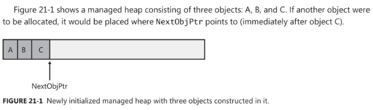
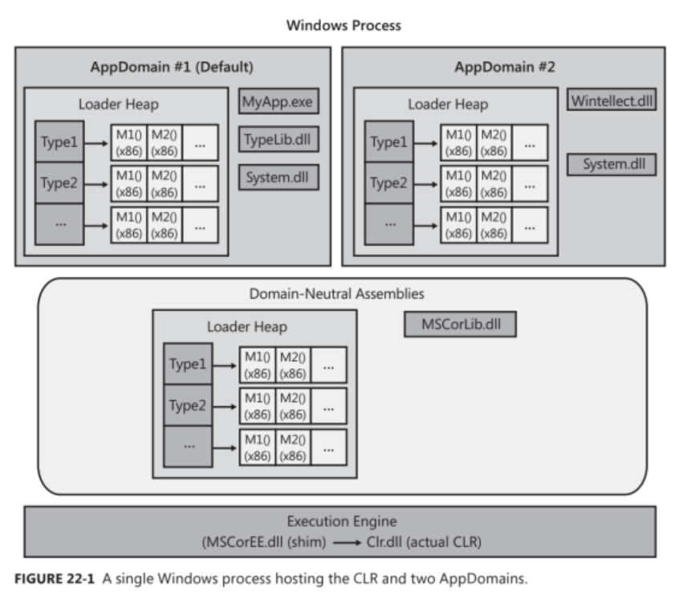
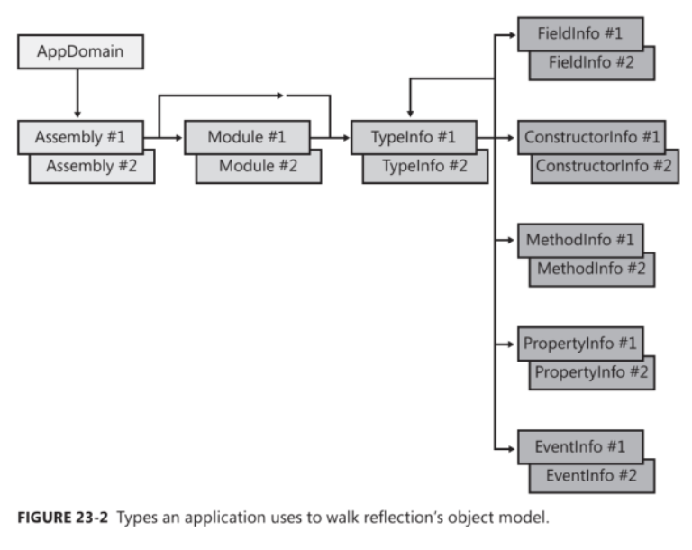

# Core Facilities

# Exceptions and State Management

An exception is when a member fails to complete the task it is supposed to perform as indicated by its name.

```
try {}
catch(InvalidOperationException ex) {}
catch {}
finally {}
```

#### The ___try___ block

The ___try block___ contains code that requires common cleanup operations, exception-recovery operations, or both. A try
block
must be associated with at least one ___catch___ or ___finally___ block.

### The ___catch___ block

A ___catch block___ contains code to execute in response to an exception. A try block can have zero or more catch blocks
associated with it.

### The ___finally___ block

The ___finally block___ contains code that's guarantee to execute.

## Exception Guidelines and Best Practices

- Use ___finally___ blocks liberally
- Don't ___catch___ everything
- Recover gracefully from an Exception
- Backing out of a partially completed operation when an unrecoverable exception occurs - maintaining state
- Hiding an implementation detail to maintain a 'Contract'

# The managed heap and garbage collection

The CLR requires that all objects to be allocated from the ___managed heap___.

C#'s ___new___ operator causes CLR to perform the following steps:

1. Calculate the number of bytes required for the type's fields (and all the fields it inherits from the base type)
2. Add the bytes required for an object's overhead (a type object pointer and sync block index). For 32-bit app each
   field requires 32 bits (8 bytes), for 64-bit each field is 64 bits, adding 16 bytes to each object.
3. The CLR then checks that the bytes required to allocate the object are available in the region. If there is enough
   space, the type's ctor is called passing NextObjPtr, and the new operator returns the reference to an object. Just
   before the reference is returned, NextObjPointer is advanced past the object and now points to the address where the
   next object will be placed in the heap.



### The garbage collection algorithm

1. When CLR starts GC, it suspends all threads in the process.
2. Then CLR performs ___marking phase___ of the GC
    - walks through all objects and sets a bit (contained in sync block index) to 0 - this indicates that all objects
      should be deleted
    - Then, the CLR looks at all active roots to see which objects they refer to
    - Any root referring to an object on the heap causes the CRL to mark an object (bit in sync block index is set to 1)
    - Once complete the heap contains some marked and some unmarked objects (the ones that will be kept and deleted
      accordingly)
3. Now when the CRL knows which objects must be kept/deleted it begins ___GC's compacting phase___ (CLR shifts the
   memory consumed by the marked objects down in the heap, so that they are contiguous in memory).
4. The CLR subtracts from each root the number of bytes that the object it referred to was shifted down in memory. This
   ensures that every root refers to the same object it did before; it's just that the object is at different location
   in memory
5. After the heap memory is compacted, the managed heap NextObjPtr is set to point to a location just after the last
   surviving object.
6. The CLR resumes all the application threads.

### GC generations

A generational GC makes following assumptions:

- The newer the object is, the shorter its lifetime will be.
- The older the object is, the longer its lifetime will be.
- Collecting a portion of the heap is faster than collecting the whole heap

### Garbage collection triggers

1. GC detects that generation 0 has filled its budged.
2. Code explicitly calls ___System.GC's static Collect method___
3. Windows is reporting low memory conditions
4. CLR is unloading an AppDomain
5. The CLR is shutting down

### Large objects

The CLR considers each single object to be either a small object or a large object. A large object is 85000 bytes or
more in size (which may change in future).
The CLR treats large objects slightly differently that how it treats small objects:

- Large objects are not allocated within the same address space as small objects; they are allocated elsewhere within
  the process' address space
- Today GC's does not compact large object, because of how much time it would require to move them in memory.
- Large objects are immediately considered to be a part of generation 2; they are never in gen 0 or 1.

### Garbage collection modes

- ___Workstation___ - this mode fine-tunes the GC for client-side applications.
- ___Server___ - this mode fine-tunes the GC for server-side applications.

___Finalization___ - allows an object to execute some code after the object has been determined to be garbage but before
the object's memory is reclaimed from the managed heap.

# CLR Hosting and AppDomains

Hosting allows any application to use the features of the common language runtime (CLR).
AppDomains allow third-party untrusted code to un in an existing process, and the CLR guarantees that the data
structures, code, and security context will not be exploited or compromised.

An ___AppDomain___ is a logical container for a set of assemblies.
AppDomain features:

- objects created by code in one AppDomain cannot be accessed directly by code in another AppDomain.
- AppDomains can be unloaded.
- AppDomains can be individually secured
- AppDomains can be individually configured



# Assembly Loading and Reflection

Reflection drawbacks:

- Reflection prevents type safety at compile time.
- Reflection is slow.

Constructing an Instance of a Type:

- System.Activator's CreateInstance methods
- System.Activator's CreateInstanceFrom methods
- System.AppDomain's methods (CreateInstance, CreateInstanceAndUnwrap, CreateInstanceFrom, CreateInstanceFromAndUnwrap)
- System.Reflection.ConstructorInfo's Invoke instance method



# Runtime Serialization

___Serialization___ is a process of converting an object or a graph of connected objects into a stream of bytes.

___Deserialization___ is the process of converting a stream of bytes back into its graph of connected objects.