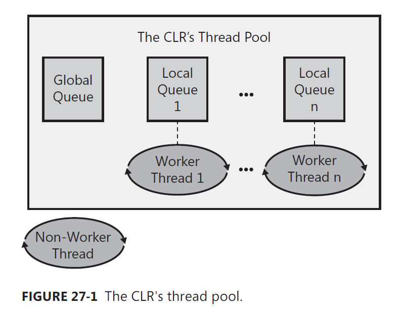

# Threading

1. [Thread Basics](#thread-basics)
2. [Compute-Bound Asynchronous Operations](#compute-bound-asynchronous-operations)
3. [I/O-Bound Asynchronous Operations](#hybrid-thread-synchronization-constructs)
4. [Primitive Thread Synchronization Constructs](#io-bound-asynchronous-operations)
5. [Hybrid Thread Synchronization Constructs](#primitive-thread-synchronization-constructs)

## Thread basics

A thread is a Windows concept whose job is to virtualize the CPU.

#### Thread Overhead

Every thread has one of each of the following:

- Thread kernel object
- Thread environment block (TEB)
- User-mode stack
- Kernel-mode stack
- DLL thread-attach and thread-detach notifications

At any given moment in time, Windows assigns one thread to a CPU. When the time-slice of the thread expires, windows
context switches to another thread. Every context-switch requires that Windows performs the following actions

1) Save the values in the CPU's registers to the currently running thread's context structure inside the thread's
   kernel object.
2) Select one thread from the set of existing threads to schedule next.
3) Load the values in the selected thread's context structure into the CPU's registers.

#### Reasons to use threads

- Responsiveness (typically for client-side GUI applications)
- Performance (for client and serer side applications)

[Back to top ⇧](#threading)

## Compute-Bound Asynchronous Operations

The ThreadPool.QueueUserWorkItem method and the Timer class always queue work
items to the global queue. Worker threads pull items from this queue using a first-in-first-out (FIFO)
algorithm and process them. Because multiple worker threads can be removing items from the global
queue simultaneously, all worker threads contend on a thread synchronization lock to ensure that
two or more threads don’t take the same work item. This thread synchronization lock can become a
bottleneck in some applications, thereby limiting scalability and performance to some degree.


Now let’s talk about Task objects scheduled using the default TaskScheduler (obtained by
querying TaskScheduler’s static Default property). When a non-worker thread schedules a Task,
the Task is added to the global queue. But, each worker thread has its own local queue, and when a
worker thread schedules a Task, the Task is added to calling the thread’s local queue.

When a worker thread is ready to process an item, it always checks its local queue for a Task first.
If a Task exists, the worker thread removes the Task from its local queue and processes the item.
Note that a worker thread pulls tasks from its local queue by using a last-in-first-out (LIFO) algorithm.
Because a worker thread is the only thread allowed to access the head of its own local queue, no
thread synchronization lock is required and adding and removing Tasks from the queue is very fast.
A side effect of this behavior is that Tasks are executed in the reverse order that they were queued.

If a worker thread sees that its local queue is empty, then the worker thread will attempt to steal
a Task from another worker thread’s local queue. Tasks are stolen from the tail of a local queue and
require that a thread synchronization lock be taken, which hurts performance a little bit. Of course,
the hope is that stealing rarely occurs, so this lock is taken rarely. If all the local queues are empty,
then the worker thread will extract an item from the global queue (taking its lock) using the FIFO
algorithm. If the global queue is empty, then the worker thread puts itself to sleep waiting for something
to show up. If it sleeps for a long time, then it will wake itself up and destroy itself, allowing the
system to reclaim the resources (kernel object, stacks, TEB) that were used by the thread.

The thread pool will quickly create worker threads so that the number of worker threads is equal
to the value pass to ThreadPool’s SetMinThreads method. If you never call this method (and it’s
recommended that you never call this method), then the default value is equal to the number of CPUs
that your process is allowed to use as determined by your process’s affinity mask. Usually your process
is allowed to use all the CPUs on the machine, so the thread pool will quickly create worker threads
up to the number of CPUs on the machine. After this many threads have been created, the thread
pool monitors the completion rate of work items and if items are taking a long time to complete
(the meaning of which is not documented), it creates more worker threads. If items start completing
quickly, then worker threads will be destroyed.

[Back to top ⇧](#threading)

## I/O-Bound Asynchronous Operations

When you mark a method as ___async___, the compiler basically transforms your method's code into a type that
implements a state machine.

Async functions restrictions:

- Cannot have any ___out___ or ___ref___ parameters
- Cannot use the ___await___ operator inside a ___catch___, ___finally___, or ___unsafe___ block
- Cannot take a lock that supports thread ownership or recursion before an await operator and release it after the
  await operator. The reason is because one thread might execute the code before the ___await___ and a different
  thread might execute the code after the await. If you use ___await___ within a C# ___lock___ statement, the
  compiler issues an error. If explicitly call ___Monitor's Enter___ and ___Exit___ instead, the code will compile but
  ___Monitor.Exit___ will throw a ___SynchronizationLockException___ at run time
- Within a query expression, the await opertor may only be used withing the first collection expression of the
  initial ___from___ clause or within the collection expression of a ___join___ clause

How compiler transforms async function into a state machine

```c#
private static async Task<String> MyMethodAsync(Int32 argument)
{
    var local = argument;
    try {
        var result1 = await Method1Async();
        for (var x = 0; x < 3; x++)
        {
            var result2 = await Method2Async();
        }
    } catch (Exception) {
        Console.WriteLine("Catch");
    } finally {
        Console.WriteLine("Finally");
    }
    return "Done";
}
```

```c#
// AsyncStateMachine attribute indicates an asnc method (good for tools using reflection);
// the type indicates which structure implements the state machine
[AsyncStateMachine(typeof (IOBoundAsynchronousOperations.<MyMethodAsync>d__3))]
[DebuggerStepThrough]
private static Task<string> MyMethodAsync(int argument)
{
    // Create state mechine instance & initialize it
    IOBoundAsynchronousOperations.<MyMethodAsync>d__3 stateMachine = new IOBoundAsynchronousOperations.<MyMethodAsync>d__3();
    
    // Create builde returning Task<String> from this stub method
    // State machine accesses builder to set Task completion/exception
    stateMachine.<>t__builder = AsyncTaskMethodBuilder<string>.Create();
    
    stateMachine.argument = argument; // Copy arguments to state machine fields
    stateMachine.<>1__state = -1; // Initialize state machine
    
    // Start executin the state machine
    stateMachine.<>t__builder.Start<IOBoundAsynchronousOperations.<MyMethodAsync>d__3>(ref stateMachine);
    return stateMachine.<>t__builder.Task;
}
```

```c#
// THis is the state machine structure
[CompilerGenerated]
private sealed class<MyMethodAsync> d__3 : /*[Nullable(0)]*/ IAsyncStateMachine {
    // Fields for state machine's builder (Task) & its location
    public int<> 1__state;
    [Nullable(0)]
    public AsyncTaskMethodBuilder<string><> t__builder;
    
    // Argument and local variables are fields now:
    public int argument;
    private int<local> 5__1;
    [Nullable(0)]
    private Type1<result1> 5__2;
    [Nullable(0)]
    private Type1<> s__3;
    private int<x> 5__4;
    [Nullable(0)]
    private Type2<result2> 5__5;
    [Nullable(0)]
    private Type2<> s__6;
    
    // There is 1 field per awaiter type.
    // Only 1 of these fields is important at any time. That field referes
    // to the most recently executed await that is completing asynchronously
    [Nullable(new byte[] { 0, 1 })]
    private TaskAwaiter<Type1><> u__1;
    [Nullable(new byte[] { 0, 1 })]
    private TaskAwaiter<Type2><> u__2;

    public<MyMethodAsync> d__3() {
        base..ctor();
    }

    // This is the state machine method itself
    void IAsyncStateMachine.MoveNext() {
        int num = this.<>1__state;
        string result; // Task's result value
        
        // Compiler-inserted try block ensures the state machine's task completes
        try {
            if ((uint)num > 1U)
                this.<local>5__1 = this.argument;
                
            // Try block that we had in our original code
            try {
                TaskAwaiter<Type1> awaiter1;
                TaskAwaiter<Type2> awaiter2;
                if (num != 0) {
                    if (num != 1) { // start execution of code in 'try'
                        // Call 'Mehtod1Async' and get its awaiter
                        awaiter1 = IOBoundAsynchronousOperations.Method1Async().GetAwaiter();
                        if (!awaiter1.IsCompleted) {
                            this.<>1__state = num = 0; // 'Method1Async' is completing asynchronously
                            this.<>u__1 = awaiter1; // Save the awaiter for when we come back
                            // Capture state machine into a variable
                            IOBoundAsynchronousOperations.<MyMethodAsync>d__3 stateMachine = this;
                            // Tell awaiter to call MoveNext when operation coompletes
                            this.<>t__builder.AwaitUnsafeOnCompleted<TaskAwaiter<Type1>, IOBoundAsynchronousOperations.<MyMethodAsync>d__3>(
                                ref awaiter1, ref stateMachine);
                            return; // Thread returns to caller
                        }
                    } else { // 'Mehtod2Async' completed asynchronously
                        awaiter2 = this.<>u__2; // Restore mose recent awaiter
                        this.<>u__2 = new TaskAwaiter<Type2>();
                        this.<>1__state = num = -1;
                        goto label_13; // navigate to ForLoopEpilog
                    }
                } else { // 'Method1Async' completed asynchronously
                    awaiter1 = this.<>u__1; // Restore most-recent awaiter
                    this.<>u__1 = new TaskAwaiter<Type1>();
                    this.<>1__state = num = -1;
                }
                // After the first await, we capture the result & start the 'for' loop
                this.<>s__3 = awaiter1.GetResult(); // Get awaiter's result
                this.<result1>5__2 = this.<>s__3;
                this.<>s__3 = (Type1)null;
                this.<x>5__4 = 0; // 'for' loop initialization
                goto label_14; // Skip to 'for' loop body
            label_13: // ForLoopEpilog
                this.<>s__6 = awaiter2.GetResult();
                this.<result2>5__5 = this.<>s__6;
                this.<>s__6 = (Type2)null;
                this.<result2>5__5 = (Type2)null;
                ++this.<x>5__4; // Increment 'x' after each loop iteration
                // fall into the 'for' loop body
            label_14: // ForLoopBody
                if (this.<x>5__4 < 3) { // 'for' loop test
                    // Call 'Method2Async' and get its awaiter
                    awaiter2 = IOBoundAsynchronousOperations.Method2Async().GetAwaiter();
                    if (!awaiter2.IsCompleted) {
                        this.<>1__state = num = 1; // 'Method2Async' is completing asynchronously
                        this.<>u__2 = awaiter2; // Save the awaiter for when we come back
                        
                        // // Capture state machine into a variable
                        IOBoundAsynchronousOperations.<MyMethodAsync>d__3 stateMachine = this;
                        // Tell awaiter to call MoveNext when opertion completes
                        this.<>t__builder.AwaitUnsafeOnCompleted<TaskAwaiter<Type2>, IOBoundAsynchronousOperations.<MyMethodAsync>d__3>(
                            ref awaiter2, ref stateMachine);
                        // Thread returns to caller
                        return;
                    }
                    goto label_13; // navigate to ForLoopEpilog
                } else
                    this.<result1>5__2 = (Type1)null;
            } catch (Exception ex) {
                Console.WriteLine("Catch");
            } finally {
                // Whenever a thread physically leaves a 'try', the 'finally' executes
                // We only want to execute this code when the thread logically leaves the 'try'
                if (num < 0)
                    Console.WriteLine("Finally");
            }
            result = "Done"; // What we ultimately want to return from the async function
        } catch (Exception ex) {
            // Unhandled exception: complete state machine's Task with exception
            this.<>1__state = -2;
            this.<>t__builder.SetException(ex);
            return;
        }
        this.<>1__state = -2;
        
        // No exception: complete state machine's Task with result
        this.<>t__builder.SetResult(result);
    }

    [DebuggerHidden]
    void IAsyncStateMachine.SetStateMachine(IAsyncStateMachine stateMachine) {}
}
```

### Async functions and exception handling

When using ___await___ with ___Task___ the first inner exception is thrown instead of an ___AggregateException___.
If ___async___ function has a void return type, there is no way for a caller to discover the unhandled exception. So,
when a ___void___-returning async function throws an unhandled exception, the compiler-generated code catches it and
causes it to be rethrown using the caller's synchronization context. Usually, rethrowing these exceptions causes the
whole process to terminate

### Initiate an async function from a thread other that the thread that calls it

```c#
// Task.Run is called on the GUI thread
Task.Run(async() => {
    // This code runs on a thread pool thread
    // TODO: do intensive compute-bound processing here...
    
    await XxxAsync(); // Initiate asynchronous operation
    // Do more processing here
});
```

### Applications and Their Threading Models

The FCL defines a base class called ___System.Threading.SynchronizationContext___.
___SynchronizationContext___-derived object connects an application model to its threading model.

When you await a Task, The calling thread's SynchronizationContext object is obtained. When a thread pool thread
completes the Task, the SynchronizationContext object is used, ensuring the right threading model for your
application model. So, when a GUI thread awaits a Task, the code following the await operator is guaranteed to
execute on the GUI thread as well, allowing that code to update UI elements.

[Back to top ⇧](#threading)

## Primitive Thread Synchronization Constructs

Thread synchronization is used to prevent corruption when multiple threads access shared data ___at the same time___.

There are two kinds of primitive constructs:

- user-mode (preferred as faster than kernel mode, as special CPU instructions used to coordinate threads)
- kernel-mode

### User-mode constructs

CLR guarantees that reads and writes to a variables of the following data types are atomic: Boolean, Char, (S)Byte,
(U)Int16, (U)Int32, (U)IntPtr, Single and reference types.

There are two kinds of primitive user-mode thread synchronization constructs:

- ___Volatile constructs___, which perform an atomic read or write operation on a variable containing a simple data
  type at a specific time
- ___Interlocked constructs___, which perform an atomic read and write operation on a variable containing a simple
  data type at a specific time

#### Volatile constructs

When threads are communicating with each other via shared memory, write the last value by calling ___Volatile.Write___
and read the first value by calling ___Volatile.Read___

To make sure that ___Volatile.Read___ and ___Volatile.Write___ are used correctly ___volatile___ keyword was
introduced. The JIT compiler ensures that al accesses to a volatile field are performed as volatile reads and writes.
Furthermore, the ___volatile___ keyword tells the c# and JIT compilers not to cache the field in a CPU register,
ensuring that all reads to and from the field actually cause the value to be read from memory

```c#
internal sealed class ThreadsSharingData                                    |internal sealed class ThreadsSharingData
{                                                                           |{
    private Int32 _flag = 0;                                                |    private volatile Int32 _flag = 0;
    private Int32 _value = 0;                                               |    private Int32 _value = 0;
                                                                            |
    // This method is executed by one thread                                |    // This method is executed by one thread
    public void Thread1()                                                   |    public void Thread1()
    {                                                                       |    {
        // Note: 5 must be written to _value before 1 is written to _flag   |        // Note: 5 must be written to _value before 1 is written to _flag
        _value = 5;                                                         |        _value = 5;
        Volatile.Write(ref _flag, 1);                                       |        _flag = 1;
    }                                                                       |    }
                                                                            |
    // This method is executed by another thread                            |    // This method is executed by another thread
    public void Thread2()                                                   |    public void Thread2()
    {                                                                       |    {
        // Note: _value must be read after _flag is read                    |        // Note: _value must be read after _flag is read
        if (Volatile.Read(ref _flag) == 1)                                  |        if (_flag == 1)
        {                                                                   |        {
            Console.WriteLine(_value);                                      |            Console.WriteLine(_value);
        }                                                                   |        }
    }                                                                       |    }
}                                                                           |}
```

#### Interlocked constructs

Each of the System.Threading.Interlocked class's methods perform an atomic read wnd write operation. In addition,
all the Interlocked methods are full memory fences (any variable writes before the call to an Interlocked method
execute before the Interlocked method, and any variable reads after the call execute after the call).

### Kernel-Mode constructs

Much slower that the user-mode constructs, because they require coordination from the Windows operating system itself.
Benefits:

- When a kernel-mode construct detects contention on a resource, Windows blocks the losing thread sos that it is not
  spinning on a CPU, wasting processor resources
- Kernel-mode constructs can synchronize native and managed threads with each other.
- Kernel-mode constructs can synchronize threads running in different processes on the same machine.
- Kernel-mode constructs can have security applied to them to prevent unauthorized accounts from accessing them.
- A thread can block until all kernel-mode constructs in a set are available or until any one kernel-mode construct
  in a set has become available.
- A thread can block on a kernel-mode construct specifying a timeout value; if the thread can't have access to th
  resource it wants in the specified amount of time, then the thread is unblocked and can perform other tasks.

#### Semaphore constructs

Semaphores are simply Int32 variables maintained by the kernel. A thread waiting on a semaphore blocks when the
semaphore is 0 and unblocks when the semaphore is > 0. When a thread waiting on a semaphore unblocks, the kernel
automatically subtracts 1 from the semaphore's count.
The behaviour of semaphore:

- When multiple threads are waiting on an auto-reset event, setting the event causes only one thread to become
  unblocked.
- When multiple threads are waiting on a manual-reset event, setting the event causes all threads to become unblocked.
- When multiple threads are waiting on a semaphore, releasing the semaphore causes releaseCount threads to become
  unblocked (where releaseCount is the argument passed to Semaphore's Release method)

#### Mutex Constructs

A Mutex represents a mutual-exclusive lock. Works similar to AutoResetEvent or a Semaphore with a count of 1 because
all three constructs release only one waiting thread at a time.

- Mutex objects record which thread obtained it by querying the calling thread's Int32 ID.
- Mutex makes sure that the calling thread is the same thread that obtained the Mutex.
- Mutex objects maintain a recursion count indicating how many times the owning thread owns the Mutex.

[Back to top ⇧](#threading)

## Hybrid Thread Synchronization Constructs

[Back to top ⇧](#threading)
