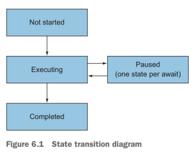

# [C# 2–5](../../README.md)

1. [C# 2](#c-2)
    - Generics
    - Nullable value types
    - Simplified delegate creation
    - Iterators
    - Minor features
2. [C# 3: Linq and everything that comes with it](#c-3-linq-and-everything-that-comes-with-it)
    - Automatically implemented properties
    - Implicit typing
    - Object and collection initializers
    - Anonymous types
    - Lambda expressions
    - Expression trees
3. [C# 4: Improving interoperability](#c-4-improving-interoperability)
    - Dynamic typing
    - Optional parameters and named arguments
    - COM interoperability improvements
    - Generic variance
4. [C# 5: Writing asynchronous code](#c-5-writing-asynchronous-code)
    - Synchronization contexts
    - Async method declarations
5. [Async implementation](#async-implementation)
6. [C# 5 bonus features](#c-5-bonus-features)

## C# 2

### Nullable value types

```csharp
    Nullable<int> one = 1;
    Nullable<int> two = null;
    
    // same
    int? oneMore = 1;
    int? twoAgain = null;
```

### Simplified delegate creation

### Iterators

### Minor features

[Back to top ⇧](#c-25)

## C# 3: Linq and everything that comes with it

### Automatically implemented properties

### Implicit typing

### Object and collection initializers

### Anonymous types

### Lambda expressions

### Expression trees

___Expression trees___ are representation of code as data.

```csharp
Expression<Func<int, int, int>> adder = (x, y) => x + y;

// Same
ParameterExpression xParameter = Expression.Parameter(typeof(int), "x");
ParameterExpression yParameter = Expression.Parameter(typeof(int), "y");
Expression body = Expression.Add(xParameter, yParameter);

ParameterExpression[] parameters = new[] { xParameter, yParameter };

Expression<Func<int, int, int>> adder1 = Expression.Lambda<Func<int, int, int>>(body, parameters);
```

Only expression-bodied lambda expressions can be converted to expression trees.

## Extension methods

```csharp
namespace NodaTime.Extensions;

public static class DateTimOffsetExtentions
{
    public static Instant ToInstant(this DateTimeOffset dateTimeOffset)
    {
        return Instant.FromDateTimeOffset(dateTimeOffset);
    }
}
```

### Query Expressions

### LINQ

[Back to top ⇧](#c-25)

## C# 4: Improving interoperability

### Dynamic typing

```csharp
dynamic text = "hello world";
```

Rule of the dynamic type:

- There's an implicit conversion from any non-pointer type to dynamic
- There's an implicit conversion from an expression of type dynamic to any non-pointer type
- Expressions that involve a value of type dynamic are usually bound at execution time.
- Most expressions that involve a value of type dynamic have a compile-time type of dynamic as well.

Only dynamic values are considered dynamically

### Optional parameters and named arguments

Optional parameters allow the caller to omit an argument entirely.
Named arguments allow the caller to make it clear to both the compiler and any human reader which parameter an
argument is intended to relate to.

The default value for a parameter must be one of the following expressions:

- a compile-time constant (such as numeric, string literal or null)
- A default expression such as ___default(CancellationToken)___
- a ___new___ expression, such as ___new Guid()___ or ___new CancellationToken()___. This is valid only for value types.

### COM interoperability improvements

### Generic variance

It's about safely converting between generic types based on their type arguments and paying particular attention to
the direction in which data travels.

```charp
IEnumerable<string> strings = new List<string> {"a", "b", "c"};
IEnumerable<object> objects = strings;

Action<object> objectAction = obj => Console.WriteLine(obj);
Action<string> stringAction = objectAction;
stringAction("Print me.");
```

___Covariance___ occurs when values are returned only as output.
___Contravariance___ occurs when values are accepted only as input.
___Invariance___ occurs when values are used as input and output.

[Back to top ⇧](#c-25)

## C# 5: Writing asynchronous code

___Asynchronous function___ - is _always_ either a method or an anonymous function that's declared with the _async_
modifier, and it can use the _await_ operator for await expressions.
The **await expressions** - if the operation the expression is awaiting hasn't completed yet, the asynchronous function
will return immediately, and it'll the continue where it left off whe the value becomes available

### Synchronization contexts

Asynchronous functions get back to the right thread by using **SynchronizationContext**, a class that's existed since
.NET 2.0 ans is used by other components such as **BackgroundWorker**.
A __Synchronization context__ generalizes the idea of executing a delegate on an appropriate thread.

### Async method declarations

```csharp
public async Task FooAsync() { ... }
public async Task<string> FooStringAsync() { ... }
```

#### Return types from async methods

Asynchronous functions are limited to the following return types:

- void
- Task
- Task<TResult>
  The ability to return **void** from an async method is designed for compatibility with event handlers.

```csharp
// Example of async void event handler for a UI button click handler
private async void LoadStockPrice(object sender, Event args e)
{
    string ticker = tickerInput.Text;
    decimal price = await stockPriceService.FetchPriceAsync(ticker);
    priceDisplay.Text = price.ToString("c");
}
```

#### Parameters in async methods

None of the parameters in an async method can use the __out__ or __ref__ modifiers.

#### Usage tips

- Avoid context capture using ConfigureAwait (where appropriate)
    - the result of calling ConfigureAwait(false) is that the continuation won't be scheduled against the original
      synchronization context; it'll execute on a thread-pool thread.
- Enable parallelism by starting multiple independent tasks
- Avoid mixing synchronous and asynchronous code
- Allow cancellation whenever possible

## Async implementation

### The structure of the generated code

The implementation of async code is in the form of a __state machine__.
The compiler will generate a private nested struct to represent the asynchronous method,
and it must also include a method with the same signature as the one declared.

The state machine keeps track of where you are within the async method (not started, executing, paused, complete).



Simple async method

```csharp
private static async Task PrintAndWait(TimeSpan delay)
{
    Console.WriteLine("Before first delay");
    await Task.Delay(delay);
    Console.WriteLine("Between delays");
    await Task.Delay(delay);
    Console.WriteLine("After second delay");
}
```

Generated code (slightly modified for readability)

```csharp
// Stub method generated
[AsyncStateMachine(typeof (ExploringAsync.<PrintAndWait>d__0))]
[DebuggerStepThrough]
private static Task PrintAndWait(TimeSpan delay)
{
    // Initializes state machine including method parameters
    var stateMachine = new PrintAndWaitStateMachine
    {
        delay = delay,
        builder = AsyncTaskMethodBuilder.Create()
        state = -1
    };
    // Runs the state machine until it needs to wait
    stateMachine.builder.Start(ref stateMachine);
    // Returns the task representing the async operation
    return stateMachine.builder.Task;
}

// Private struct for the state machine
[CompilerGenerated]
[StructLayout(LayoutKind.Auto)]
private struct PrintAndWaitStateMachine : IAsyncStateMachine
{
    // State of the stte machine (where to resume)
    public int state;
    // The builder hooking into async infrastructure types
    public AsyncTaskMethodBuilder builder;
    // Original method parameter
    public TimeSpan delay;
    // Awaiter to fetch result from when resuming
    private TaskAwaiter awaiter;

    // Main state machine work goes here
    void IAsyncStateMachine.MoveNext()
    {
        int num1 = this.state;
        try
        {
            TaskAwaiter awaiter;
            int num2;
            if (num1 != 0)
            {
                if (num1 != 1)
                {
                    Console.WriteLine("Before first delay");
                    awaiter = Task.Delay(this.delay).GetAwaiter();
                    if (!awaiter.IsCompleted)
                    {
                        this.state = num2 = 0;
                        this.awaiter = awaiter;
                        this.builder.AwaitUnsafeOnCompleted<TaskAwaiter, ExploringAsync.PrintAndWaitStateMachine>(ref awaiter, ref this);
                        return;
                    }
                }
                else
                {
                    awaiter = this.awaiter;
                    this.awaiter = new TaskAwaiter();
                    this.state = num2 = -1;
                    goto label_9;
                }
            }
            else
            {
                awaiter = this.awaiter;
                this.awaiter = new TaskAwaiter();
                this.state = num2 = -1;
            }
            awaiter.GetResult();
            Console.WriteLine("Between delays");
            awaiter = Task.Delay(this.delay).GetAwaiter();
            if (!awaiter.IsCompleted)
            {
                this.state = num2 = 1;
                this.awaiter = awaiter;
                this.builder.AwaitUnsafeOnCompleted<TaskAwaiter, ExploringAsync.PrintAndWaitStateMachine>(ref awaiter, ref this);
                return;
            }
label_9:
            awaiter.GetResult();
            Console.WriteLine("After second delay");
        }
        catch (Exception ex)
        {
            this.state = -2;
            this.builder.SetException(ex);
            return;
        }
        this.state = -2;
        this.builder.SetResult();
    }

    [DebuggerHidden]
    void IAsyncStateMachine.SetStateMachine([Nullable(1)] IAsyncStateMachine stateMachine)
    {
        // Connects the builder and the boxed state machine
        this.builder.SetStateMachine(stateMachine);
    }
}
```


## C# 5 bonus features

### Capturing variables in foreach loop

