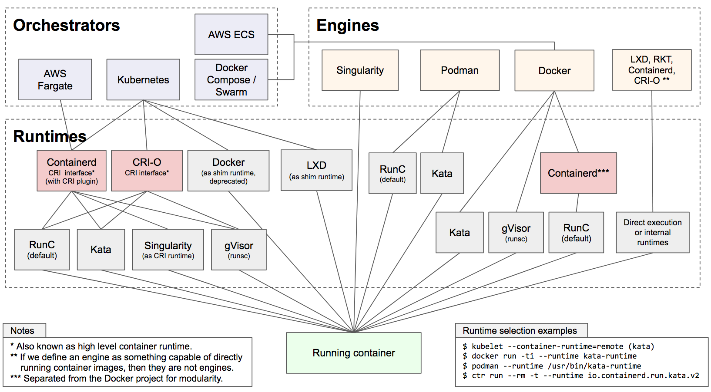
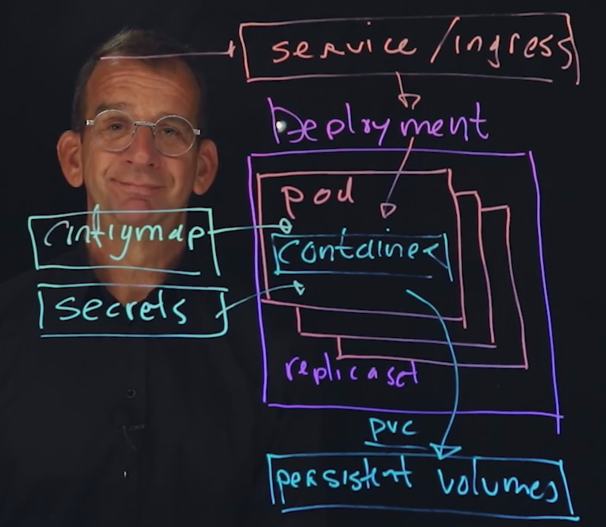
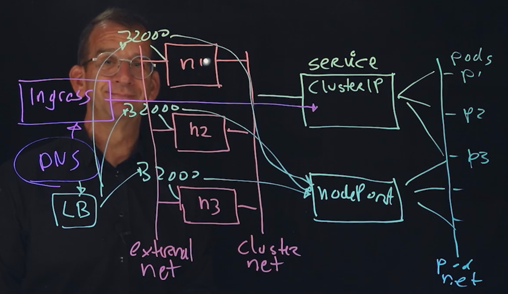
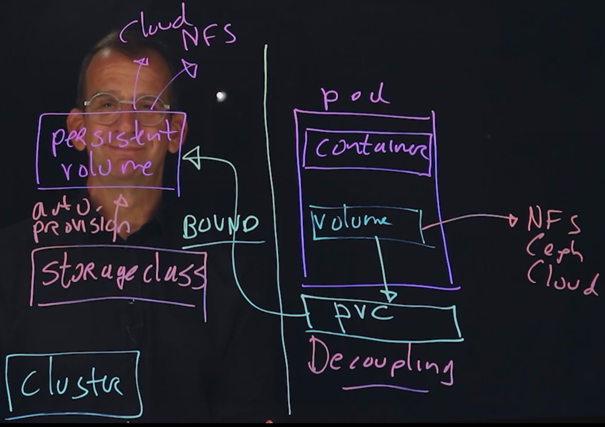
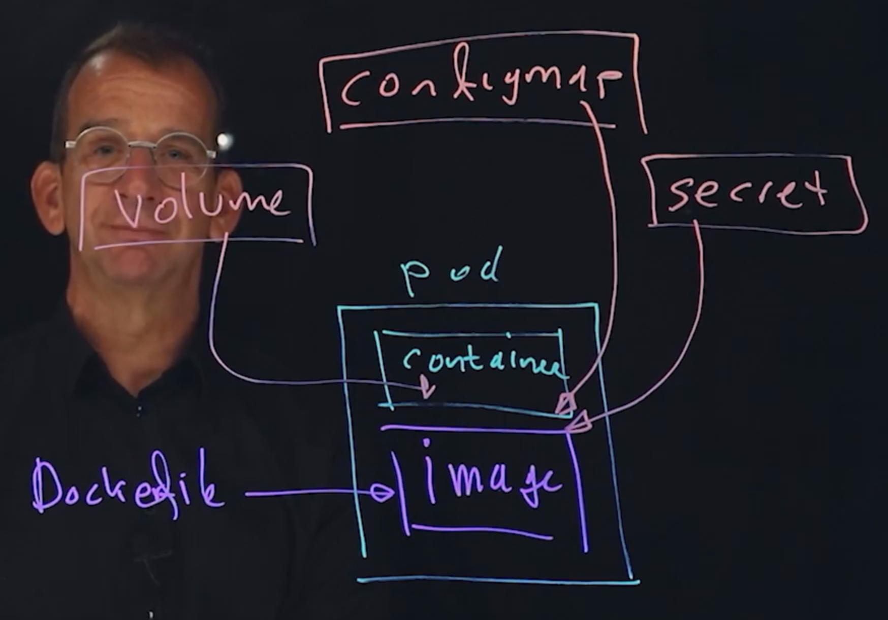
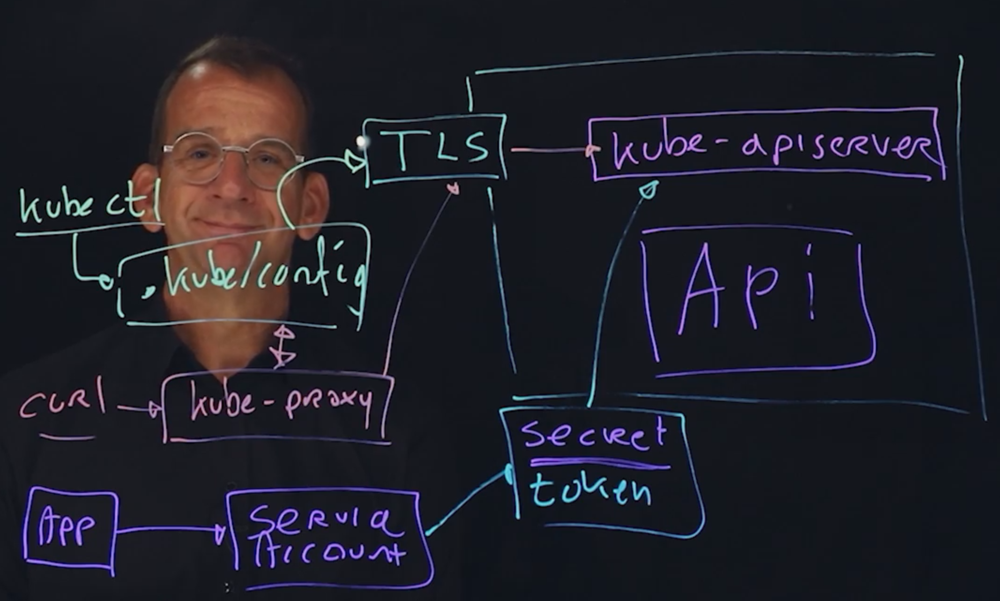

# Getting Started with Kubernetes

1. [Understanding Kubernetes and Cloud Native Computing](#understanding-kubernetes-and-cloud-native-computing)
2. [Understanding containers]()
3. [Installing Kubernetes]()
4. [Exploring Kubernetes]()
5. [Running Applications in Kubernetes]()
6. [Providing Access to Applications](#providing-access-to-applications)
7. [Configuring Storage](#configuring-storage)
8. [Decoupling Applications-Specific Information](#decoupling-application-specific-information)
9. [Managing the Kubernetes API]()
10. [Running Kubernetes in Enterprise]()
11. [Managing Kubernetes in Enterprise]()
12. [Exploring Advanced Application Management Options]()
13. [Troubleshooting Kubernetes]()

## Understanding Kubernetes and Cloud Native Computing

Kubernetes distributions combine core vanilla Kubernetes with solutions from the ecosystem.
Some distributions are "opinionated" others are not.

Common Kubernetes distributions:

- Rancher (on-premise)
- Canonical Kubernetes (on-premise)
- Google Anthos (on-premise)
- Red Hat OpenShift (on-premise)
- GKE (google kubernetes)
- AKS (azure kubernetes)
- EKS (amazon kubernetes)
- Minikube - learning solution
- Kind
- others

**Container** is an application that starts from the application image. The application image starts one application,
the "entrypoint application", and contains all libraries required to start the application.
Container application run in an isolated env, which makes them secure by nature. Multiple containers can be combined to
run Microservices.
Containers are Linux: they are built on features offered by the Linux operation system.

Containers and Linux
Containers started as applications that were started in isolated env, offered by the **chroot jail**.
__The Chroot jail__ further developed into linux kernel namespaces, providing isolation at different levels.
Containers are platform independent, they only require a container runtime to be started (linux, windows, cloud).

Container registry - provides a public platform for distribution of container images (e.g. Docker Hub).

## Container engines and container runtimes

**Container engine** is a piece of software that accepts user requests, including command line options, pulls images,
and from the end user's perspective runs the container. Most container engines don't actually run the containers, they
rely on an OCI compliant runtime.

Container engine is responsible for:

- Handling user input
- Handling input over and API
- Pulling container images from registry
- Expanding decompressing and expanding the container image on disk
- Preparing a container mount point, typically on copy-on-write storage
- Preparing the metadata which will be passed to the container **container runtime** to start the container correctly
- Calling the container runtime

**Container runtime** is a lower level component typically used in a **container engine**. The Open Containers
Initiative (OCI) Runtime Standard reference implementation is **runc**.

The container runtime is responsible for:
-Consuming the container mount point provided by the **Container Engine**

- Consuming the container metadata provided by the **Container Engine**
- Communicating wit the kernel to start containerized processes
- Setting up cgroups
- Setting up SELinux Policy
- Setting up App Armor rules



In a Kubernetes environment, a container runtime is used, but not a container engine. So **crictl** is a tool that
allows you to interact with the container runtime while using Kubernetes

Docker, Podman and CRI layers are not technically the same, the commands have been developed to be compatible. The
compatibility is offered in the spirit of OCI standardization. Because of that in the example below the **podman**
command can be replaced with **docker** or **crictl** and it should work the same.

```shell
podman run -d nginx # run container in detached state
podman ps # look for container ID
podman stop <containerId> # stop the container by id
podman run busybox
podman ps -a # show all containers (including stopped)
podman run -it busybox # open interactive terminal inside container
Ctrl + P, Ctrl + Q # detach from container without stopping it
podman attach <contaner_name> # attach to a running container using the container Id or name, either to view its ongoing output or to control it interactively
exit # exit the container
```

## Image

The image is the foundation to start a container. Application images are configured to start an entrypoint application.
Can be used to start services or oneshot applications. System images (like ubuntu, busybox and others) are used as the
foundation to build custom application images. System images are NOT a replacement for a virtual machine.

## Using containerfile

Containerfile (AKA Dockerfile) is the common way to build custom images. It contains instructions required to build a
container image.
Son instead of distributing images, you can distribute the Containerfile. Use **podman build -t imagename .** to build
the container image based on the Containerfile in the current directory. Images will be stored on the local systems, but
can also be pushed to the repository.

## Exploring kubernetes

**kubectl** is the main Kubernetes management utility: use it to manage any resource or resource property
**kubeadm** is the Kubernetes administration utility: use it to build and manage clusters and cluster nodes

```shell
minikube dashboard # opens kubernetes dashboard in browser

kubectl create deploy myapp --image=nginx --replicas=3 # create applications using
kubectl get all # view the result of above command
kubectl -h # get help
```

#### YAML and Kubernetes

Kubernetes resources are stored in the Etcd database in JSON format. JSON format is not easy to edit, which is why YAML
is the current format to define Kubernetes resources.

```shell
kubectl create deploy myapp --image=nginx --replicas=3 --dry-run=client -o yaml > myapp.yaml # generates yaml file configuration for command.
kubectl apply -f myapp.yaml # applies tye YAML code to currently running resources. If resource does not exist yet, it will be created.
kubectl create -f myapp.yaml # creates the resource from YAML, if resource already exists, an error is generated.
kubectl replace -f myapp.yaml # replaces current application code with new YAML code provided.
kubectl delete -f myapp.yaml # deletes the application.

kubectl explain deploy.spec # shows all fields that can be used in deployment specification
```

### Kubernetes core objects

- Container - a container image is a ready-to-run software package containing everything needed to run an application
- Pods are the smallest deployable units of computing that you can create and manage in Kubernetes. A Pod (as in a pod
  of whales or pea pod) is a group of one or more containers, with shared storage and network resources, and a
  specification for how to run the containers
- Replica set - a ReplicaSet's purpose is to maintain a stable set of replica Pods running at any given time. As such,
  it is often used to guarantee the availability of a specified number of identical Pods.
- Deployment - a Deployment provides declarative updates for Pods and ReplicaSets. Is one of the standard ways to run
  applications. The idea is about running multiple pods in a cloud environment.
- Persistent Volumes - represent the storage that is available in specific clustered environment. A PersistentVolume (
  PV) is a piece of storage in the cluster that has been provisioned by an administrator or dynamically provisioned
  using Storage Classes.
- Persistent Volume Claim (PVC) - allows container to access the storage directly.
- Service - is a method for exposing a network application that is running as one or more Pods in your cluster.
- Ingress - exposes HTTP and HTTPS routes from outside the cluster to services within the cluster.
- ConfigMap - is an API object used to store non-confidential data in key-value pairs.
- Secrets - is an object that contains a small amount of sensitive data such as a password, a token, or a key.
- Etc...



### Kubernetes API

```shell
kubectl api-resources # shows a list of resources that is defined in the API
kubectl api-versions # shows resource versions
kubectl explain # allows users to explore attributes of Kubernetes resources as they are defined in the API
```

# Deploying applications to Kubernetes

Options for running applications:

- The **Deployment** is running Pods, adding features like scalability, availability, and zero-downtime application
  update.
- The **DaemonSet** is used to run one application instance on each cluster node.
- The **StatefulSet** is used for applications that need persistent state and naming (commonly used for databases)
- The **Job** is used to run a Pod once, until it completes
- The **Pod** is a single running instance of an application, normally used for analysis and troubleshooting only

## Running Pods

```shell
kubectl get pods # shows currently running Pods, regardless how they were started
kubectl describe pods <podname> # shows details about a Pod
kubectl get pods <podname> -o yaml # shows the YAML spec of the Pod as it is currently running in the Etcd cluster database
kubectl delete pods <podname> # will delete a Pod
kubectl run <podname> --image=<image_name>
```

## Using Deployments

Deployment is the standard way of running applications.

Deployments offers such benefits:

- easy scalability
- managing availability
- zero-downtime application updates

```shell
kubectl create -f myapp.yaml # runs an application from yaml file
kubectl create deployment <deployment_name> --image=<image_name>
kubectl run # starts stand-alone Pods and shouldn't be used except for troubleshooting
```

## Organizing Applications with Namespaces

**Namespace** is used to provide isolation of resources within a single cluster.

Namespace is a default entity to which security related settings are applied. By default , used applications are started
in the **default** namespace. Kubernetes system components are in **kube-system** namespace.
Users can create their own namespaces.

```shell
kubectl create ns <namespace_name> # to create a new namespace
# use -n to manage resources in a specific namespace
kubectl create ... -n <namespace>
kubectl get ... -n <namespace>
kubectl config set-context --current --namespace=<namespace_name> # used to set current namespace
```

## Scaling Applications

HorizontalPodAutoscaler can be used to configure automatic scalability (requires installation of the Metrics Server).
Or can scale apps manually ***kubectl scale ... --replicas=3***
Or use ***kubectl edit*** to live edit a running app and change the number of replicas.

```shell
kubectl edit deployments.apps nginx-sandbox # edit yaml file of deployment
kubectl scale deployment nginx-sandbox --replicas=0 # scale to zero replicas, if don't want to delete deployment
kubectl scale deployment nginx-sandbox --replicas=1
```

## Managing application Update and Rollback

Major changes to a deployment will have the deployment history updated. While changing deployment history, a new
ReplicaSet is created, while the old ReplicaSet is maintained with 0 Pods in it. This makes it easy to undo a change.

```shell
kubectl rollout history deployment nginx-sandbox # show overview of recent changes to a deployment

kubectl create deployment rolling-nginx --image=nginx:1.15 # create deployment
kubectl edit deployments.apps rolling-nginx # update yaml configuration
kubectl rollout history deployment rolling-nginx # view change history
kubectl describe deployments.apps rolling-nginx
kubectl rollout history deployment rolling-nginx --revision=2 # view what changed in v2
kubectl rollout history deployment rolling-nginx --revision=1 # view what change in v1
kubectl rollout undo deployment rolling-nginx --to-revision=1 # roll back to rev 1
```

## Labels

Labels are used by Kubernetes core processes as well as users to identify applications. In kubernetes labels are
everywhere. Deployments keep track of managed Pods using labels and selectors. Network related resources like services
are doing the same. Administrators can use labels to implement update strategies like canary deployments.

```shell
kubectl label ... # command to manage labels
```

```shell
kubectl get all --show-labels
kubectl get all --selector app=rolling-nginx # get info of all resources with app=rolling-nginx label
kubectl label deploy rolling-nginx type=static # add new label 'type=static' to deployment
kubectl label deploy rolling-nginx app- # unlabel 'app=...' label
kubectl get pods --show-labels
```

## Providing access to Applications

### Understanding Kubernetes Networking

Cluster has nodes. The nodes in a cluster are the computers that externally running the different kubernetes workloads,
the pods (n1, n2, n3 on the image below). Nodes are connected to 2 networks: internal network (cluster network) and
external network (where users are coming in). The internal network is defined in software (SDN - software defined
network). There is another SDN - the Pod network. Pod network is defined by container defined interface and this makes
sure you can run Pods. The Pod network is where you find your individual Pods, each Pod has its own IP address. Service
is used to access Pods, and is load balancing to different Pods. So, Service is an API based load balancer. **Service**
has it's own IP address, and by default the service Ip address is visible on **ClusterIP**. That means that it cannot be
directly accessed from the outside.

There are 2 solutions to access Service:

- Ingress - connects directory to service, the disadvantage is it supports only http/https traffic.
- Another type of service is not ClusterIp, it is **NodePort**. NodePort is exposing a port on the cluster nodes around
  32000, and this port is forwarder to the NodePort service. That means by using NodePort you have something that makes
  your application accessible directly on the ClusterNodes. User are connected through DNS to external LoadBalancer, and
  it balances the workload between different exposed NodePorts.



### Using services

Service types:

- ClusterIP - default, provides internal access only
- NodePort - allocates a specific node port which needs to be opened on the firewall
- LoadBalancer - currently only implemented in public cloud
- ExternalName - new objet that works on NDS names; redirection is happening at a DNS level
- Service without selector - used for direct connections based on IP/port, without endpoint. Useful for connections to
  database, or between namespaces

```shell
kubectl create deploy nginx-svc --image=nginx --replicas=3 # create new deployment
kubectl get all -o wide --selector app=nginx-svc # get deployment details by selector and include ip addresses
kubectl expose deploy nginx-svc --port=80 # expose deployment port
kubectl edit svc nginx-svc # change service from ClusterIp to NodePort
kubectl get svc # view services
curl <minikube ip>:<nodeport_port> # access deployment through NodePort exposed port
```

### Kubernetes Application Auto-registration with DNS

Services automatically register with the Kubernetes internal DNS server. While obtaining networking information, all
Pods use this internal DNS server (i.e. for Pods to resolve hostnames the Kubernetes first and then go outside). As a
result, all Pods can access all services that are configured internally (if no further network restrictions applied)

```shell
kubectl run -it busybox --image=busybox -- sh
cat /etc/resolv/conf
# nameserver 10.96.0.10
# search default.svc.cluster.local svc.cluster.local cluster.local
# options ndots:5
ping nginx-svc # PING nginx-svc (10.105.244.168): 56 data bytes
```

ClusterIp from kube-dns is used within all of the pods as the name resolver by default. And that is Pods in Kubernetes
automatically can resolve all of the service names that are configured.

```shell
kubectl get svc -n kube-system
# NAME       TYPE        CLUSTER-IP   EXTERNAL-IP   PORT(S)                  AGE
# kube-dns   ClusterIP   10.96.0.10   <none>        53/UDP,53/TCP,9153/TCP   20m
```

### Understanding Ingress

**Ingress** is a Kubernetes API resource that exposes HTTP and HTTPS routes to services running inside a cluster

This provides multiple benefits:

- Services get externally reachable URLs
- Ingress can load balance
- Ingress can take care of TLS/SSL termination

You need to run Ingress Pod in cluster to do the work.

Ingress controllers are provided by the Kubernetes ecosystem. The Ingress controller consists of an API resource, as
well asn an Ingress Pod that is started in the cluster. Minikube provides easy Ingress access using Minikube addon. Use
***minikube addon enable ingress*** to enable it.

```shell
minikube addons list # list available addons
minikube addons enable ingress # enable ingress
kubectl get ns # new namespace is added
# NAME              STATUS   AGE
# default           Active   68m
# ingress-nginx     Active   5m22s
kubectl get all -n ingress-nginx # view all resources inside ingress-nginx namespace
kubectl create ingress nginx-svc-ingress --rule="/=nginx-svc:80"
kubectl get ingress
# NAME                CLASS   HOSTS   ADDRESS         PORTS   AGE
# nginx-svc-ingress   nginx   *       172.18.67.188   80      2m17s
curl 172.18.67.188 # return response from nginx-svc
```

Services and Ingress are used to provide access to applications. Port-forwarding can be used to analyze or troubleshoot
applications.
Port forwarding by default is to a port at the loopback address of the kubectl client. Use **--address=...** to expose
on the NIC IP address. **kubectl port-forward svc/nginx-svc 8888:80

```shell
kubectl port-forward svc/nginx-svc 8888:80 &
curl localhost:8888
```

## Configuring storage

Containers are started from a read-only container image. After starting a container, the image is copied to a directory
on the host that runs the container. Within that directory, and environment is created to store files that are modified
within the container. The directory is ephemeral, and will be removed when the container is removed.

In stand-alone containers, volumes can be used to represent storage. Volumes point o external storage, and guarantee
that modified data will survive the container lifetime. A common way to create a container volume, is by using
persistent directories on the host that runs the container.

### Kubernetes storage needs

- In Kubernetes, orchestrated and replicated containers should not have any relation to specific hosts.
- To obtain that goal, network-based storage or cloud-based storage should be provided
- This storage can be provided in two ways:
    - Pod volumes define storage from within the Pods
    - PersistentVolumes (PV) provide an external solution to completely decouple storage from Pods

A Pod volume is a property of a Pod that allows for using any type of storage. Pod volumes are sed if a specific Pod is
always using the same storage type. If flexibility in addressing storage is required, PersistentVolumes and
PersistentVolumeClaims (PVC) should be used.

```yaml 
apiVersion: v1
kind: Pod
metadata:
  name: pod-volume-storage
spec:
  containers:
  - name: centos-1
    image: centos:7
    command:
      - sleep
      - "3600"
    volumeMounts:
    - name: volume-name
      mountPath: /centos1
  - name: centos-2
    image: centos:7
    command:
      - sleep
      - "3600"
    volumeMounts:
      - name: volume-name
        mountPath: /centos2
  volumes:
  - name: volume-name
    emptyDir: {}
```

```shell
k create -f .\pod-volume-storage.yaml
k exec -it pod-volume-storage -c centos-1 -- touch /centos1/centos-1-file
k exec -it pod-volume-storage -c centos-2 -- ls -l /centos2
# total 0
# -rw-r--r-- 1 root root 0 Aug 29 14:18 centos-1-file
```

### Decoupling storage from applications

If a software developer wants to provide a YAML manifest file to run an app in any type of cluster, it cannot contain
any specific storage information. This can be obtained by using PV and PVC.

In the decoupled storage scenario, the site network admin provides a PV, representing he actual storage that is used on
that site. The developer would define a PVC, which specified whether read-only or read/write storage is required, as
well as the required storage size. The Pod volume uses the PVC as its volume type allowing it to dynamically connect to
specific storage available at the site.



### Creating Persistent Volumes

PersistentVolume is the Kubernetes object that defines how to connect to external storage and uses different spec
attributes:

- **capacity** - how much storage is available
- **accessMode** - which access mode
- **storageClassName** - (optional) how to bind to a specific storage class
- **persistentVolumeReclaimPolicy** - what to do when a corresponding PersistentVolumeClaim is deleted
- **type** - which specific storage type to use (NFS, azureDisk, etc.)

```yaml
kind: PersistentVolume
apiVersion: v1
metadata:
  name: pv-example
  labels:
    type: local
spec:
  capacity:
    storage: 2Gi
  accessModes:
    - ReadWriteOnce
  hostPath:
    path: "/pv-storage"
```

```shell
k create -f .\create-persistent-volume.yaml
k get pv
k describe pv
```

### Understanding PersistentVolumeClaim

The PersistentVolumeClaim is a Kubernetes API object tht has a spec that defined required storage properties.

- **accessMode** - which type of access is required
- **resources** - how much storage is required
- **storageClassName** - which storage class type is required

Based on above properties, the PVC will reach out to a PV to bind to specific storage

```yaml
kind: PersistentVolumeClaim
apiVersion: v1
metadata:
  name: pv-claim-example
spec:
  accessModes:
    - ReadWriteOnce
  resources:
    requests:
      storage: 1Gi
```

```shell
k create -f .\create-persistent-volume-claim.yaml
k get pvc
k get pv,pvc
# NAME                                                        CAPACITY   ACCESS MODES   RECLAIM POLICY   STATUS      CLAIM                      STORAGECLASS   REASON   AGE
# persistentvolume/pv-example                                 2Gi        RWO            Retain           Available                                                      7m23s
# persistentvolume/pvc-cada67d6-30a1-4e70-9dee-ac852bfbc34d   1Gi        RWO            Delete           Bound       default/pv-claim-example   standard                42s
#
# NAME                                     STATUS   VOLUME                                     CAPACITY   ACCESS MODES   STORAGECLASS   AGE
# persistentvolumeclaim/pv-claim-example   Bound    pvc-cada67d6-30a1-4e70-9dee-ac852bfbc34d   1Gi        RWO            standard       42s
```

### Set up Pods to Use PV

```yaml
apiVersion: v1
kind: Pod
metadata:
  name: pv-pod-example
spec:
  containers:
  - name: pv-container
    image: nginx
    ports:
      - containerPort: 8
        name: "http-server"
    volumeMounts:
    - name: pv-storage-example
      mountPath: "/usr/share/nginx/html"
  volumes:
    - name: pv-storage-example
      persistentVolumeClaim:
        claimName: pv-claim-example
```

```shell
k create -f .\create-pod-with-pvc.yaml
k exec -it pv-pod-example -- touch /usr/share/nginx/html/hello.md
minikube ssh
ls -l /tmp/hostpath-provisioner/default/pv-claim-example/
# total 0
# -rw-r--r-- 1 root root 0 Aug 29 14:59 hello.md
```

## Decoupling Application-Specific Information

### Decoupling configuration Files and Variables from Applications

Decoupling starts by having a Container image and in this container image you don't want to have any site specific
information. To do that normally you would create a container Dockerfile (or Containerfile) and you can ADD or COPY
files into container image, but that is specifically you don't wanna do in decoupled environment. To do that in
Kubernetes environment we encapsulate the container Image into a Pod and run it together with the container. And this
container needs to get site-specific info using ConfigMap. ConfigMap is a cloud replacement to the local configuration
files. In ConfigMap you can store variables and make them accessible within a Pod, using it as variable or config file.
If configmaps have to be secured, Secrets can be used (both files and vars). If a lot of info needs to be configured (>
1Mb), Volumes have to be used (in PV mounted through PVC).


### Using ConfigMaps for Variables

ConfigMaps can be used to store vars and config in the cloud. Max size is 1Mb, if more then Volumes should be used.

ConfigMaps can be used in two ways:

- To provide variables
- To provide configuration files
-

The ConfigMap will be addressed form a Pod according to how it is used:

- ConfigMaps containing variables are accessed using enfFrom
- ConfigMap containing configuration files are mounted

Secrets are base64 encoded ConfigMaps

```shell
cat .\configmaps\mysql-configuration
# MYSQL_ROOT_PASSWORD=password
# MYSQL_USER=nick
k create cm mysql-configuration --from-env-file=./configmaps/mysql-configuration # create config map from file
k create deploy mariadb-with-configuration --image=mariadb --replicas=3 # create db deployment
kubectl set env deploy mariadb-with-configuration --from=configmap/mysql-configuration # add configmap configuration to the deployment
k get deploy mariadb-with-configuration -o yaml
# ...
#    spec:
#      containers:
#      - env:
#        - name: MYSQL_ROOT_PASSWORD
#          valueFrom:
#            configMapKeyRef:
#              key: MYSQL_ROOT_PASSWORD
#              name: mysql-configuration
#        - name: MYSQL_USER
#          valueFrom:
#            configMapKeyRef:
#              key: MYSQL_USER
#              name: mysql-configuration
# ...
```

### Storing Configuration Files in ConfigMaps

Configuration files are typically used to provide site-specific info to apps. To store config files in cloud, ConfigMap
can be used.

```shell
k create cm <config-name> --from=file=<file-path>
```

If a ConfigMap is created from a directory, all files in that directory are included in the configMap. To use config
file in an app, the ConfigMap should be mounted in to it. ConfigMaps are limited in size and should be less than 1Mb.

```shell
echo "hello world" > .\configmaps\index.html
k create cm config-file-example --from-file=./configmaps/index.html # create config-map form file
k describe cm config-file-example # view config map
k create deploy config-file-nginx  --image=nginx # create deployment
k edit deploy config-file-nginx # edit configuration to mount config map volume
# spec.template.spec
#      volumes:
#      - configMap:
#          defaultMode: 420
#          name: config-file-example
#        name: config-map-volume

# spec.template.spec.containers
#        volumeMounts:
#        - mountPath: /usr/share/nginx/html
#          name: config-map-volume

k exec -it config-file-nginx-568847dd49-qcxzd -- cat /usr/share/nginx/html/index.html # view mounted configMap file contents
# hello world
```

### Understanding Secrets

Secrets allow for storage of sensitive data such as passwords, Auth tokens, and SSH keys. Using Secrets eliminates the
need for data to be placed in a Pod, and reduces the risk of accidental exposure. Some Secrets are automatically created
by the system, users can also define secrets. System-created Secrets are important for Kubernetes resources to connect
to other cluster resources. Secrets are not encrypted, they are base64 encoded.

## Managing the Kubernetes API

### Understanding the API

And API exposes resources that are vailable to the end-user client program. Kubernetes uses a set of APIs, each with its
own status nd version. While specifiying Kubernetes resources in YAML files, it's important to identify the API version
that should be used. API access is provided by the API server. The **kubectl** uses certificates configured in
**~/.kube/config** to access the API. The Kubernetes APIs are extensible, which allows additional objects to be created.

```shell
k api-resources # gives list of all api resources
```

### Use kube-proxy to Connect to the API

In order to access the Kubernetes API there's a process **kube-apiserver** which is secured using TLS. **Kubectl** by
default uses ~./kube/config file which contains all the info to securely access through TLS to the API. Also API can be
accessed using **curl**, but for every requests all the TLS keys should be specified. To omit that there's a
**kube-proxy** process, running on localhost and provides TSL secured access to the API. If and APP needs access to API,
it uses *service account*, and service account uses secret, which uses token to access API.



### Exploring the API with curl

The APIs are RESTful. To use certificates they can be specified in curl command: **curl --cert myuser.pem --key
myuser-key.pem --cacert /root/myca.pem https://controller:6443/api/v1**. To make an easier access without using
certificates kubectl proxy can be used: **kubectl proxy --port=8001 &**

```shell
kubectl proxy --port=8001 & # start proxy server
curl http://localhost:8001/version # show api version
curl http://localhost:8001/api/v1/namespaces/default/pods # list all available pods
```

### Using ***kubectl explain*** to Describe Kubernetes Objects

All Kubernetes API resources are well documented

- **kubectl api-resources** - used for an overview of resources and where they are defined
- **kubectl api-versions** - shows current resource versions
- **kubectl explain** - gives details about current API resources and allows users to explore exactly which resource
  properties are available. Use it to verify objects defined in YAML files

```shell
k explain deploy # list top level fields
k explain deploy --recursive # list all fields recursive
```